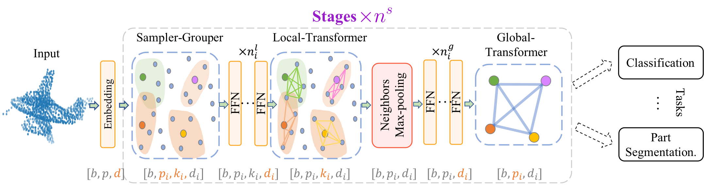

# Pointsformer: Learning Deep Representation for Point Clouds with Transformer


Anonymous submission to ICDM 2021.

To provide the original development codes for reproduction, we did not change/re-organize any codes (i.e., model name).

We will re-organize the codes for a clear representation once the paper is accepted or rejected.

## Introduction
This repo is built for offical reproduction of Pointsformer, it includes all the original development codes, training models, training logs, and ablation studies.

## Installation
Our codes are tested on Ubuntu 18.04, CUDA10.1+, PyTorch1.7.0+ and Python3.7+.

We suggest the use of Conda for installation.
Required packages:
```bash
einops 0.3.0
h5py 2.10.0
numpy
torch 1.7.0
torchvision 0.8.1
tqdm 4.47.0
scikit-learn 0.23.1
``` 

### Building only the CUDA kernels for Farthest Point Sampling operation (FPS):
Install the FPS CUDA operation:
```bash
pip install pointnet2_ops_lib/.

# Or if you would like to install them directly (this can also be used in a requirements.txt)

pip install "git+git://github.com/anonymous2submit/Pointsformer.git#egg=pointnet2_ops&subdirectory=pointnet2_ops_lib"
```
Note: If you have trobule with installing pointnet2_ops package, you can also manually replace it to CPU version, which would has a little influence on the performance, and slow down the training/testing.

Here is an example about how to change the model file to a cpu version (that not replies on the pointnet2_ops package)
```python
# remove the import
# from pointnet2_ops import pointnet2_utils

# change pointnet2_utils.furthest_point_sample to our self-defined farthest_point_sample
fps_idx = farthest_point_sample(xyz, self.groups).long()
# fps_idx = pointnet2_utils.furthest_point_sample(xyz, self.groups).long() # [B, npoint]
``` 

## Classification
```bash
# please cd the classification folder
cd classification
```

__Data Preparation__

You don't need to manually download the ModelNet40 data. The data.py file would automatically download and unzip the [Model40 datset](https://shapenet.cs.stanford.edu/media/modelnet40_ply_hdf5_2048.zip).

__Training__

```bash
#You can try both classify.py and main.py. classify.py doesn't support resume operation.
# By default, the model/log will be saved to checkpoint/{modelname}-{timestamp}/ folder. 
# You can change the {timestamp} to messages you want by --msg, e.g., --msg demo
# For more settings, please refer classify.py/main.py
python classify.py --model model21H
# or
python main.py --model model21H
```

__Testing__

```bash
# We provides two versions of testing.
# eval_voting.py: provides the results of original testing results and the OA voting method results;
# eval_voting_enhance.py: provides the results of original testing results and both mAcc and OA voting method results;
python eval_voting.py --model model21H --msg bak
# or
python eval_voting_enhance.py --model model21H --msg bak
```
__Pretrained models/logs__

Results in Table II

| Method |  Model | Training log |Voting results|
| :--- | :---: | :---: | :---: |
| Pointsformer   | [model 93.5](https://drive.google.com/file/d/1aErP-AeY3wPEz80b961BgAYgVLE1pwnK/view?usp=sharing) | [log](https://drive.google.com/file/d/14nc4kDHn-dvPCIG3hoHJW0ALG8cl8Cgg/view?usp=sharing) |[[vote_mAcc 90.9]](https://drive.google.com/file/d/1iMtIV43C-sLJkbQSE6WMf5y8hyTz7gdE/view?usp=sharing) [[vote OA 93.9]](https://drive.google.com/file/d/1F9uaozITFlH0t3ukkeKaiCLhJdbxCe7b/view?usp=sharing) |

Results in Table III

| Before L-T. |  Before G-T. | mAcc |OA| Model Name| Download|
| :--- | :---: | :---: | :---: |:---: |:---: |
| 1,1| 1,1 | 90.1 |93.0  |model23B | [model/log/args](https://drive.google.com/drive/folders/1ydKAUdFhNTDCMj6GwIVOtAa05CbwPr7Y?usp=sharing)|
| 2,2| 2,2 | 90.0 | 93.0 |model23A | [model/log/args](https://drive.google.com/drive/folders/1wOlPTbk7wW-AVHZ4ZraMDDEaMU7pCNgR?usp=sharing)|
| 3,3| 3,3 | 90.3 | 93.5 |model23E | [model/log/args](https://drive.google.com/drive/folders/1hcw7qgKSq89jDXjL9xoiqkvUwtmilbsc?usp=sharing)|
| 4,4| 4,4 | 90.5 | 93.5 |model21H | [model/log/args](https://drive.google.com/drive/folders/1pfoYe6P5frqwCX8gP2SqD9WclT6RLR04?usp=sharing)|

Results in Table IV

|L-T. |G-T. | k |Channel|reduce|stages|mAcc|OA| Model Name| Download|
| :--- | :---: | :---: | :---: |:---: |:---: |:---: |:---: |:---: |:---: |
| 2 | 2 | 32 | 256 |4,4 |2 |89.9 |93.1 |model23I |[[mAcc]](https://drive.google.com/drive/folders/1DBV-X0nrQb5GxZx_hsMIooZxx9r0Xbwa?usp=sharing)  [[OA]](https://drive.google.com/drive/folders/1L6jRINTaLAzUI06HC-Xmmt8PPgndisa9?usp=sharing)|
| 4 |4| 32 |128|4,4 |2 |90.5|93.5 |model21H |[[both]](https://drive.google.com/drive/folders/1JVtnQkAxrbnWx5E1SMWl2O2hcJOz8PJe?usp=sharing) |
|2|2|24|128|4,4|2|90.2|93.0|model23G | [[both]](https://drive.google.com/drive/folders/1j5KeszOn5HUT_cddCu-5hBcK7zFs9bmC?usp=sharing)|
|2|2|32|64|4,2,2|3|90.1|93.0|model21A | [[mAcc]](https://drive.google.com/drive/folders/1DxmUAsngVjcJWg7UzSCou1Zp-S3A0q9y?usp=sharing) [[OA]](https://drive.google.com/drive/folders/1VFgQseEiYkyup2gfXXt5QuUbCBdBPPxo?usp=sharing)|
|2|2|32|32|4,2,2|3|89.8|92.9| model21B|[[both]](https://drive.google.com/drive/folders/1VFgQseEiYkyup2gfXXt5QuUbCBdBPPxo?usp=sharing) |
|2|2|32|128|4,2,2|3|89.9|92.8|model23C |[[mAcc]](https://drive.google.com/drive/folders/1ZBfrCM8LrS7yqX1RTIcy_B67vH_w5N1N?usp=sharing) [[OA]](https://drive.google.com/drive/folders/1r-1V87BEyWOtVUG3erDMqk7589p8o-IK?usp=sharing) |


Results in Table V

| Method|mAcc(%)|OA(%)| Model Name| Download|
| :--- | :---: | :---: | :---: |:---:| 
| ReLU          |90.7| 93.0|model10A |[[mAcc]](https://drive.google.com/drive/folders/1_UJ6zLP4EROmyazDWSJwt1T3rZL2TlJ0?usp=sharing)[[OA]](https://drive.google.com/drive/folders/1t-_bbHqToyofVn5vEir0TOZxcuRts-lw?usp=sharing) |
| Dropout(0.1)  |90.3| 93.2|model22H |[[mAcc]](https://drive.google.com/drive/folders/1uU7jsMRdJDnFQk9rA7BCsSep0nGeo6We?usp=sharing)[[OA]](https://drive.google.com/drive/folders/1J1N9iIHBFVcxVRTqsiPlCrfRMBynP7gQ?usp=sharing) |
| GELU          |90.5| 93.5|model21H |[[download]](https://drive.google.com/drive/folders/1J1N9iIHBFVcxVRTqsiPlCrfRMBynP7gQ?usp=sharing) |


Results in Fig. 8

| Layers| Model Name| Download|
| :--- | :---: | :---: |
| 53 | Model21H | [download](https://drive.google.com/drive/folders/1anB0e1hmehSJ87FdnKCtzEn42QZSOeRQ?usp=sharing) |
| 101 | model23K | [download](https://drive.google.com/drive/folders/1B114BldlAp1dkI2DXSX03H-ItSPwcN7P?usp=sharing) |


## Part Segmentation
```bash
# please cd the part_segmentation folder
cd part_segmentation
```

__Dataset__

Download and unzip [ShapeNet Part](https://shapenet.cs.stanford.edu/media/shapenetcore_partanno_segmentation_benchmark_v0_normal.zip) (674M). Then symlink the paths to it as follows:
``` 
mkdir -p data
ln -s /path-to-shapenet-part/shapenetcore_partanno_segmentation_benchmark_v0_normal data
``` 

__Training__

```bash
# you can change the parameters accordingly, see train.py
# this demo provides the original training commands of our pointsformer
python train.py --model pointsformerE  --normal --log_dir pointsformerE_normal_test1 --batch_size 64
```
__Evaluating__

```bash
# you can change the parameters accordingly, see train.py
# this demo provides the original training commands of our pointsformer
python test_voting.py --model pointsformerE --normal --log_dir pointsformerE_normal_test1
```

__Pretrained models/logs__

Results on Table VII (includes the results in Table VI, as Pointsformer-A)
| Method| Model Name| Download(model/log/voting)|
| :--- | :---: | :---: |
| Pointsformer-A (also in Table VI) |pointsformerE2 | [model/log/voting](https://drive.google.com/drive/folders/1oYDOEkJZMaBmNmOnWpzA_40R9YYgssnZ?usp=sharing)|
| Pointsformer-B | pointsformerE1| [model/log/voting](https://drive.google.com/drive/folders/1oYDOEkJZMaBmNmOnWpzA_40R9YYgssnZ?usp=sharing)|
| Pointsformer-C | pointsformerE3| [model/log/voting](https://drive.google.com/drive/folders/1oYDOEkJZMaBmNmOnWpzA_40R9YYgssnZ?usp=sharing)|
| Pointsformer-D | pointsformerE4| [model/log/voting](https://drive.google.com/drive/folders/1oYDOEkJZMaBmNmOnWpzA_40R9YYgssnZ?usp=sharing)|
